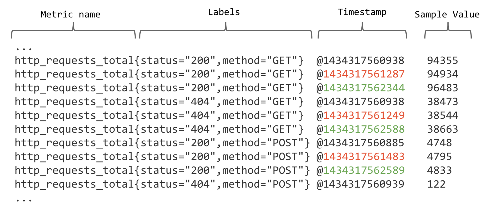

与Tracing不一样。OpenTelemetry在Metrics上可以说"建树不深"-尤其是Java
`OpenTelemetry`有自己的Metrics API，但是这些API只能在自己的代码中使用。
因为`SpringBoot`使用的是`Micrometer`而非`OpenTelemetry`。
或者换句话说，`OpenTelemetry`目前是要去兼容`Micrometer`。


主要体现在OpenTelemetry的收集器。

io.micrometer 和 opentelemetry在 metric不太一样。相当于两种协议，但是可以桥接
这两种协议都可以在prometheus和grafana展示。


因此，在mertircs方面，就没必要桥接了，直接用SpringBoot自带的。

因为一般来说， mertics的backend都支持 OpenTelemetry协议。

promothus这种，其实是不光是 mertics，因此他要转成相关的协议。

promothus如何识别metrics协议的？
不识别，是mertrcis自己需要转成Prometheus的形式。


架构图如下所示：


tracing是主动推，而metrics缺主要是要反过来查询。
因此，需要暴露一个额外的http接口。


##如何快速理解Micrometer中的Tag和Metrics Name

Prometheus 存储的所有数据都是时间序列数据（Time Serie Data，简称时序数据）。时序数据是具有时间戳的数据流，该数据流属于某个度量指标（Metric）和该度量指标下的多个标签（Label）。

每个Metric name代表了一类的指标，他们可以携带不同的Labels，每个Metric name + Label组合成代表了一条时间序列的数据。

**可以看到，这些Label标签是一个个的键值对。可以依据这些键值对中进行更加细致的进行分析，在Micrometer中，Metric name就对应着Prometheus的Metric name，Tags就是Prometheus的Label标签。**


# Quick-Start

基于此，我们来快速做一个测试：

##pom依赖

```
        <!-- 增加Springboot metrics所需要的依赖 -->
        <dependency>
            <groupId>org.springframework.boot</groupId>
            <artifactId>spring-boot-starter-actuator</artifactId>
        </dependency>
        <!-- 导出到prometheus所支持的数据格式所需要的依赖 -->
        <dependency>
            <groupId>io.micrometer</groupId>
            <artifactId>micrometer-registry-prometheus</artifactId>
        </dependency>
```


```java
@RestController
public class MetricsDemoController {

    @Autowired
    private MeterRegistry registry;


    @GetMapping(value = "/helloCounted", produces = "application/json;charset=UTF-8")
    public String helloCounted() {
        Counter counter = registry.counter("api.hello.counted", "http.status", "200");
        counter.increment();
        return "helloCounted";
    }

}
```
MeterRegistry中创建Counter的方法如下：
```java
    /**
     * Tracks a monotonically increasing value.
     * @param name The base metric name
     * @param tags Sequence of dimensions for breaking down the name.
     * @return A new or existing counter.
     */
    public Counter counter(String name, Iterable<Tag> tags) {
        return Counter.builder(name).tags(tags).register(this);
    }

    /**
     * Tracks a monotonically increasing value.
     * @param name The base metric name
     * @param tags MUST be an even number of arguments representing key/value pairs of
     * tags.
     * @return A new or existing counter.
     */
    public Counter counter(String name, String... tags) {
        return counter(name, Tags.of(tags));
    }
```
Tag的定义如下，其实就是一个键值对：
```java
public interface Tag extends Comparable<Tag> {

    String getKey();

    String getValue();

    static Tag of(String key, String value) {
        return new ImmutableTag(key, value);
    }

    @Override
    default int compareTo(Tag o) {
        return getKey().compareTo(o.getKey());
    }

}

```

而通过可变参数生成Tag（`Tags.of(tags)`方法)的实现如下：
```java
    /**
     * Return a new {@code Tags} instance containing tags constructed from the specified
     * key/value pairs.
     * @param keyValues the key/value pairs to add
     * @return a new {@code Tags} instance
     */
    public static Tags of(@Nullable String... keyValues) {
        if (keyValues == null || keyValues.length == 0) {
            return empty();
        }
        if (keyValues.length % 2 == 1) {
            throw new IllegalArgumentException("size must be even, it is a set of key=value pairs");
        }
        Tag[] tags = new Tag[keyValues.length / 2];
        for (int i = 0; i < keyValues.length; i += 2) {
            tags[i / 2] = Tag.of(keyValues[i], keyValues[i + 1]);
        }
        return new Tags(tags);
    }
```
可以看到，基数的参数就是Key，偶数的参数就是Value。

值得说明的是，Tag是一个静态的参数


```yaml
management:
  metrics:
    export:
      prometheus:
        enabled: true
  endpoint:
    metrics:
      enabled: true
    prometheus:
      enabled: true
  endpoints:
    web:
      exposure:
        include: '*'
```

启动这个服务并调用一下/helloCounted接口，然后通过prometheus如下的链接：
`localhost:8080/actuator/prometheus`


```
# HELP tomcat_sessions_rejected_sessions_total  
# TYPE tomcat_sessions_rejected_sessions_total counter
tomcat_sessions_rejected_sessions_total 0.0
# HELP executor_queue_remaining_tasks The number of additional elements that this queue can ideally accept without blocking
# TYPE executor_queue_remaining_tasks gauge
executor_queue_remaining_tasks{name="applicationTaskExecutor",} 2.147483647E9
executor_queue_remaining_tasks{name="taskScheduler",} 2.147483647E9
# HELP tomcat_sessions_active_max_sessions  
# TYPE tomcat_sessions_active_max_sessions gauge
tomcat_sessions_active_max_sessions 0.0
# HELP process_cpu_usage The "recent cpu usage" for the Java Virtual Machine process
# TYPE process_cpu_usage gauge
process_cpu_usage 3.1017403304450623E-4
# HELP executor_active_threads The approximate number of threads that are actively executing tasks
# TYPE executor_active_threads gauge
executor_active_threads{name="applicationTaskExecutor",} 0.0
executor_active_threads{name="taskScheduler",} 0.0
# HELP jvm_gc_pause_seconds Time spent in GC pause
# TYPE jvm_gc_pause_seconds summary
jvm_gc_pause_seconds_count{action="end of major GC",cause="Metadata GC Threshold",} 1.0
jvm_gc_pause_seconds_sum{action="end of major GC",cause="Metadata GC Threshold",} 0.034
jvm_gc_pause_seconds_count{action="end of minor GC",cause="Metadata GC Threshold",} 1.0
jvm_gc_pause_seconds_sum{action="end of minor GC",cause="Metadata GC Threshold",} 0.006
# HELP jvm_gc_pause_seconds_max Time spent in GC pause
# TYPE jvm_gc_pause_seconds_max gauge
jvm_gc_pause_seconds_max{action="end of major GC",cause="Metadata GC Threshold",} 0.034
jvm_gc_pause_seconds_max{action="end of minor GC",cause="Metadata GC Threshold",} 0.006
# HELP log4j2_events_total Number of fatal level log events
# TYPE log4j2_events_total counter
log4j2_events_total{level="warn",} 0.0
log4j2_events_total{level="debug",} 0.0
log4j2_events_total{level="error",} 0.0
log4j2_events_total{level="trace",} 0.0
log4j2_events_total{level="fatal",} 0.0
log4j2_events_total{level="info",} 0.0
# HELP system_cpu_usage The "recent cpu usage" of the system the application is running in
# TYPE system_cpu_usage gauge
system_cpu_usage 0.09769350188511865
# HELP jvm_classes_unloaded_classes_total The total number of classes unloaded since the Java virtual machine has started execution
# TYPE jvm_classes_unloaded_classes_total counter
jvm_classes_unloaded_classes_total 0.0
# HELP system_load_average_1m The sum of the number of runnable entities queued to available processors and the number of runnable entities running on the available processors averaged over a period of time
# TYPE system_load_average_1m gauge
system_load_average_1m 4.10546875
# HELP jvm_gc_memory_allocated_bytes_total Incremented for an increase in the size of the (young) heap memory pool after one GC to before the next
# TYPE jvm_gc_memory_allocated_bytes_total counter
jvm_gc_memory_allocated_bytes_total 7.2955912E7
# HELP executor_pool_core_threads The core number of threads for the pool
# TYPE executor_pool_core_threads gauge
executor_pool_core_threads{name="applicationTaskExecutor",} 8.0
executor_pool_core_threads{name="taskScheduler",} 1.0
# HELP application_started_time_seconds Time taken (ms) to start the application
# TYPE application_started_time_seconds gauge
application_started_time_seconds{main_application_class="com.opencourse.Application",} 1.772
# HELP process_files_max_files The maximum file descriptor count
# TYPE process_files_max_files gauge
process_files_max_files 10240.0
# HELP application_ready_time_seconds Time taken (ms) for the application to be ready to service requests
# TYPE application_ready_time_seconds gauge
application_ready_time_seconds{main_application_class="com.opencourse.Application",} 1.776
# HELP jvm_threads_daemon_threads The current number of live daemon threads
# TYPE jvm_threads_daemon_threads gauge
jvm_threads_daemon_threads 21.0
# HELP jvm_gc_max_data_size_bytes Max size of long-lived heap memory pool
# TYPE jvm_gc_max_data_size_bytes gauge
jvm_gc_max_data_size_bytes 2.863661056E9
# HELP process_files_open_files The open file descriptor count
# TYPE process_files_open_files gauge
process_files_open_files 107.0
# HELP jvm_gc_overhead_percent An approximation of the percent of CPU time used by GC activities over the last lookback period or since monitoring began, whichever is shorter, in the range [0..1]
# TYPE jvm_gc_overhead_percent gauge
jvm_gc_overhead_percent 0.0014004399122281273
# HELP disk_free_bytes Usable space for path
# TYPE disk_free_bytes gauge
disk_free_bytes{path="/Users/xujianxing/Desktop/opencourse.site/opencourse-java-code/open-telemetry/.",} 3.0184548352E11
# HELP jvm_threads_states_threads The current number of threads
# TYPE jvm_threads_states_threads gauge
jvm_threads_states_threads{state="runnable",} 10.0
jvm_threads_states_threads{state="blocked",} 0.0
jvm_threads_states_threads{state="waiting",} 12.0
jvm_threads_states_threads{state="timed-waiting",} 3.0
jvm_threads_states_threads{state="new",} 0.0
jvm_threads_states_threads{state="terminated",} 0.0
# HELP executor_queued_tasks The approximate number of tasks that are queued for execution
# TYPE executor_queued_tasks gauge
executor_queued_tasks{name="applicationTaskExecutor",} 0.0
executor_queued_tasks{name="taskScheduler",} 0.0
# HELP http_server_requests_seconds Duration of HTTP server request handling
# TYPE http_server_requests_seconds summary
http_server_requests_seconds_count{exception="None",method="GET",outcome="SUCCESS",status="200",uri="/actuator/prometheus",} 1.0
http_server_requests_seconds_sum{exception="None",method="GET",outcome="SUCCESS",status="200",uri="/actuator/prometheus",} 0.058942475
http_server_requests_seconds_count{exception="None",method="GET",outcome="SUCCESS",status="200",uri="/helloCounted",} 1.0
http_server_requests_seconds_sum{exception="None",method="GET",outcome="SUCCESS",status="200",uri="/helloCounted",} 0.004986751
http_server_requests_seconds_count{exception="None",method="GET",outcome="SUCCESS",status="200",uri="/helloCounted2",} 1.0
http_server_requests_seconds_sum{exception="None",method="GET",outcome="SUCCESS",status="200",uri="/helloCounted2",} 0.001937863
# HELP http_server_requests_seconds_max Duration of HTTP server request handling
# TYPE http_server_requests_seconds_max gauge
http_server_requests_seconds_max{exception="None",method="GET",outcome="SUCCESS",status="200",uri="/actuator/prometheus",} 0.058942475
http_server_requests_seconds_max{exception="None",method="GET",outcome="SUCCESS",status="200",uri="/helloCounted",} 0.004986751
http_server_requests_seconds_max{exception="None",method="GET",outcome="SUCCESS",status="200",uri="/helloCounted2",} 0.001937863
# HELP jvm_buffer_memory_used_bytes An estimate of the memory that the Java virtual machine is using for this buffer pool
# TYPE jvm_buffer_memory_used_bytes gauge
jvm_buffer_memory_used_bytes{id="direct",} 44030.0
jvm_buffer_memory_used_bytes{id="mapped",} 0.0
# HELP jvm_gc_live_data_size_bytes Size of long-lived heap memory pool after reclamation
# TYPE jvm_gc_live_data_size_bytes gauge
jvm_gc_live_data_size_bytes 1.6511752E7
# HELP jvm_memory_usage_after_gc_percent The percentage of long-lived heap pool used after the last GC event, in the range [0..1]
# TYPE jvm_memory_usage_after_gc_percent gauge
jvm_memory_usage_after_gc_percent{area="heap",pool="long-lived",} 0.005765958916612791
# HELP jvm_memory_committed_bytes The amount of memory in bytes that is committed for the Java virtual machine to use
# TYPE jvm_memory_committed_bytes gauge
jvm_memory_committed_bytes{area="heap",id="PS Survivor Space",} 1.1010048E7
jvm_memory_committed_bytes{area="heap",id="PS Old Gen",} 1.89792256E8
jvm_memory_committed_bytes{area="heap",id="PS Eden Space",} 9.437184E7
jvm_memory_committed_bytes{area="nonheap",id="Metaspace",} 4.3040768E7
jvm_memory_committed_bytes{area="nonheap",id="Code Cache",} 7405568.0
jvm_memory_committed_bytes{area="nonheap",id="Compressed Class Space",} 6078464.0
# HELP jvm_buffer_total_capacity_bytes An estimate of the total capacity of the buffers in this pool
# TYPE jvm_buffer_total_capacity_bytes gauge
jvm_buffer_total_capacity_bytes{id="direct",} 44030.0
jvm_buffer_total_capacity_bytes{id="mapped",} 0.0
# HELP jvm_buffer_count_buffers An estimate of the number of buffers in the pool
# TYPE jvm_buffer_count_buffers gauge
jvm_buffer_count_buffers{id="direct",} 6.0
jvm_buffer_count_buffers{id="mapped",} 0.0
# HELP executor_pool_max_threads The maximum allowed number of threads in the pool
# TYPE executor_pool_max_threads gauge
executor_pool_max_threads{name="applicationTaskExecutor",} 2.147483647E9
executor_pool_max_threads{name="taskScheduler",} 2.147483647E9
# HELP api_hello_counted_total  
# TYPE api_hello_counted_total counter
api_hello_counted_total{http_status="200",} 1.0
# HELP process_uptime_seconds The uptime of the Java virtual machine
# TYPE process_uptime_seconds gauge
process_uptime_seconds 30.453
# HELP process_start_time_seconds Start time of the process since unix epoch.
# TYPE process_start_time_seconds gauge
process_start_time_seconds 1.695116018855E9
# HELP executor_completed_tasks_total The approximate total number of tasks that have completed execution
# TYPE executor_completed_tasks_total counter
executor_completed_tasks_total{name="applicationTaskExecutor",} 0.0
executor_completed_tasks_total{name="taskScheduler",} 0.0
# HELP tomcat_sessions_created_sessions_total  
# TYPE tomcat_sessions_created_sessions_total counter
tomcat_sessions_created_sessions_total 0.0
# HELP tomcat_sessions_active_current_sessions  
# TYPE tomcat_sessions_active_current_sessions gauge
tomcat_sessions_active_current_sessions 0.0
# HELP tomcat_sessions_expired_sessions_total  
# TYPE tomcat_sessions_expired_sessions_total counter
tomcat_sessions_expired_sessions_total 0.0
# HELP jvm_threads_peak_threads The peak live thread count since the Java virtual machine started or peak was reset
# TYPE jvm_threads_peak_threads gauge
jvm_threads_peak_threads 27.0
# HELP jvm_memory_used_bytes The amount of used memory
# TYPE jvm_memory_used_bytes gauge
jvm_memory_used_bytes{area="heap",id="PS Survivor Space",} 0.0
jvm_memory_used_bytes{area="heap",id="PS Old Gen",} 1.6511752E7
jvm_memory_used_bytes{area="heap",id="PS Eden Space",} 8.5055344E7
jvm_memory_used_bytes{area="nonheap",id="Metaspace",} 3.9750224E7
jvm_memory_used_bytes{area="nonheap",id="Code Cache",} 7375488.0
jvm_memory_used_bytes{area="nonheap",id="Compressed Class Space",} 5475752.0
# HELP jvm_threads_live_threads The current number of live threads including both daemon and non-daemon threads
# TYPE jvm_threads_live_threads gauge
jvm_threads_live_threads 25.0
# HELP tomcat_sessions_alive_max_seconds  
# TYPE tomcat_sessions_alive_max_seconds gauge
tomcat_sessions_alive_max_seconds 0.0
# HELP system_cpu_count The number of processors available to the Java virtual machine
# TYPE system_cpu_count gauge
system_cpu_count 12.0
# HELP jvm_gc_memory_promoted_bytes_total Count of positive increases in the size of the old generation memory pool before GC to after GC
# TYPE jvm_gc_memory_promoted_bytes_total counter
jvm_gc_memory_promoted_bytes_total 6881112.0
# HELP jvm_classes_loaded_classes The number of classes that are currently loaded in the Java virtual machine
# TYPE jvm_classes_loaded_classes gauge
jvm_classes_loaded_classes 8118.0
# HELP disk_total_bytes Total space for path
# TYPE disk_total_bytes gauge
disk_total_bytes{path="/Users/xujianxing/Desktop/opencourse.site/opencourse-java-code/open-telemetry/.",} 4.99963174912E11
# HELP executor_pool_size_threads The current number of threads in the pool
# TYPE executor_pool_size_threads gauge
executor_pool_size_threads{name="applicationTaskExecutor",} 0.0
executor_pool_size_threads{name="taskScheduler",} 0.0
# HELP jvm_memory_max_bytes The maximum amount of memory in bytes that can be used for memory management
# TYPE jvm_memory_max_bytes gauge
jvm_memory_max_bytes{area="heap",id="PS Survivor Space",} 1.1010048E7
jvm_memory_max_bytes{area="heap",id="PS Old Gen",} 2.863661056E9
jvm_memory_max_bytes{area="heap",id="PS Eden Space",} 1.40771328E9
jvm_memory_max_bytes{area="nonheap",id="Metaspace",} -1.0
jvm_memory_max_bytes{area="nonheap",id="Code Cache",} 2.5165824E8
jvm_memory_max_bytes{area="nonheap",id="Compressed Class Space",} 1.073741824E9
```

可以看到已经多了如下的参数：
```yaml
api_hello_counted_total{http_status="200",} 1.0
```

**对于同一个Metrics name和同一个Tag，统计一定是叠加的，因此Tag可以定义成静态对象**


```
#actuator config
management:
  endpoints:
    web:
      exposure:
        include: 'prometheus,health'
```
代码原理：
WebMvcTags 用的是过滤器。
https://www.jianshu.com/p/caa80764fb24


https://www.modb.pro/db/221999
https://www.cnblogs.com/liugp/p/16459922.html#2%E6%95%B0%E6%8D%AE%E6%A8%A1%E5%9E%8B
https://grafana.com/blog/2022/05/04/how-to-capture-spring-boot-metrics-with-the-opentelemetry-java-instrumentation-agent/
https://www.hangge.com/blog/cache/detail_2723.html
https://www.cnblogs.com/cjsblog/p/11556029.html
https://www.cnblogs.com/chanshuyi/p/06_prometheus_with_springboot_actuator.html
https://www.cnblogs.com/chanshuyi/p/06_prometheus_with_springboot_actuator.html